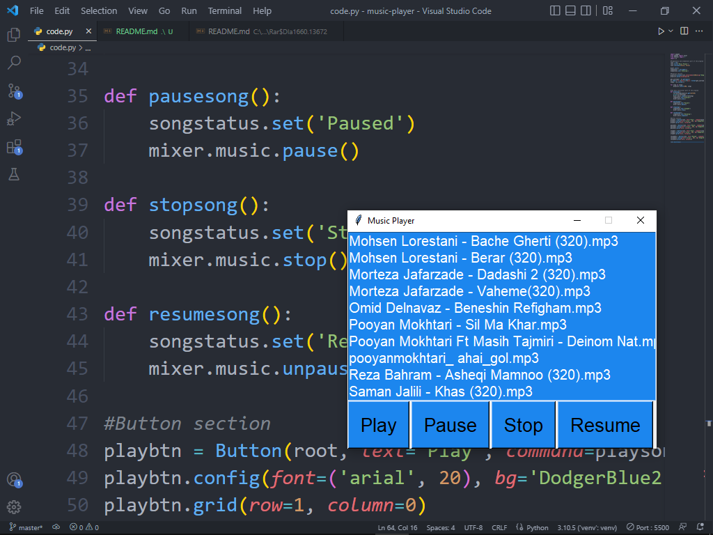

# Music Player App
the small music player program with python

## Warning
The first point: make sure to install the packages from the requirements file

The second point: when you run the program make sure to at the end of the selected files be .mp3 not another thing

## Images From Music Player


## How To Get Run And Use The Project

### 1 . Build a virtual environment with virtualenv
```
virtualenv venv
```

### 2 . Install the requirements
```
pip install -r requirements.txt
```

### 3 . Run code and enjoy from it
```
python code.py
```

## Call Me

### My email : mobingh717@gmail.com

### My account address in instagram : https://www.instagram.com/m.ghanbari717/
